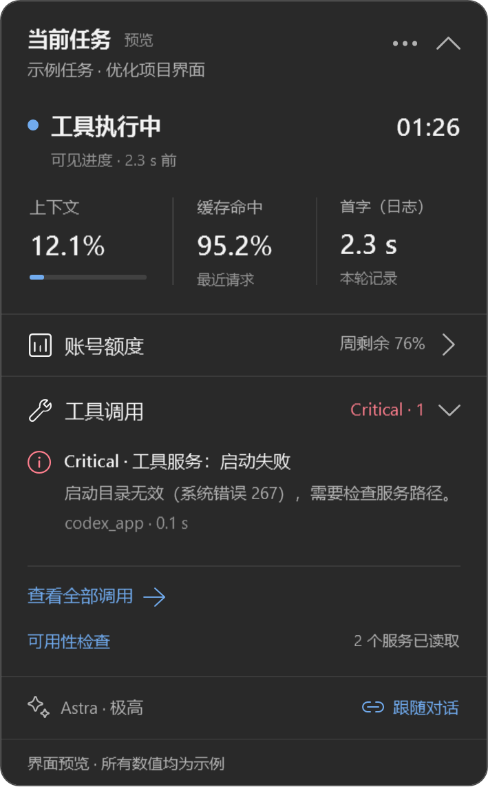

# Codex Enhance

**看清 Codex 正在做什么，以及哪里需要排查。**

Windows 原生状态浮窗，把任务进度、上下文、工具状态和账号额度放在手边。随 Codex 窗口移动、遮挡与最小化，支持深浅色、收起和固定观察任务。

[**下载 Windows 用户版**](https://github.com/hrx114514x/codex-enhance/releases/latest) · [开始使用](#三步开始使用) · [更新记录](CHANGELOG.md) · [反馈问题](https://github.com/hrx114514x/codex-enhance/issues)

<p>
  
  
</p>

*截图由真实 WPF 界面渲染，任务与数值均为示例，不含个人会话或账号信息。*

## 为什么做它

日常使用 Codex 时遇到了不少 bug：长时间没有可见进度、工具返回异常、任务结束却缺少回复。仅凭聊天界面，很难判断它在执行工具、等待确认、压缩上下文，还是遇到了异常。

Codex Enhance 把这些可观察的状态集中呈现，帮助判断等待过程、发现工具问题、回看具体记录。它是独立的社区项目，与 OpenAI 没有官方关联；提供状态检测与排查线索，不承诺识别或修复所有问题。

## 三步开始使用

1. 从 [Releases](https://github.com/hrx114514x/codex-enhance/releases/latest) 下载 **CodexEnhance-v0.2.0-win-x64.zip**，完整解压。
2. 确认已安装并登录 Windows Codex 桌面客户端。
3. 双击 **Start Codex.cmd**，打开 Codex 和状态浮窗。

**无需安装 Node.js、.NET 或开发工具。** 发布包已包含运行环境；适配 Windows x64 上的 `OpenAI.Codex` 程序包。

如果 Codex 已在运行，启动入口会保留它。当前实例未启用连接时，请保存工作并正常退出 Codex，再使用上述入口；不会自动终止你的任务。该入口仅为本次启动启用本机连接，不替换原快捷方式或自启动计划任务。

| 包内入口 | 用途 |
| --- | --- |
| **Start Codex.cmd** | 打开 Codex 并连接浮窗，推荐日常使用 |
| **Install.cmd** | 可选：安装到当前用户目录，创建桌面快捷方式 |
| **CodexEnhance.exe** | 仅打开浮窗；未连接时可手动选择任务查看日志 |
| **Preview.cmd** | 使用示例数据预览界面，不读取个人会话 |
| **开始使用.txt** | 离线说明，包括更新、连接和卸载方法 |

更新时，先从托盘退出旧版浮窗，再解压新版或运行 `Install.cmd`，设置会保留。当前发布包未做代码签名，请从本仓库下载；Release 同时提供 `SHA256SUMS.txt` 供校验。

## 一眼知道当前状态

- **任务进度**：区分工具执行、等待输入、上下文压缩，以及暂时没有可见进度。
- **性能指标**：查看上下文采样、缓存命中、首字等待与同模型的历史趋势。
- **工具调用**：日常记录收起，仅明确的 Critical 服务故障主动展开；手动收起后不反复弹出。
- **工具可用性**：查看 MCP 服务连接和工具目录变化，关注 `read_thread` 等工具是否登记。
- **账号额度**：查看剩余比例、重置倒计时、本机用量和等效金额估算。
- **跟随与固定**：自动跟随当前页面，也可固定观察某个任务；主面板和详情按需打开。

<p>
  
  
</p>

额度百分比与等效金额含义不同：金额根据本机记录和参考价格估算，**不是官方余额、账单或固定订阅上限**。数据不足时不推算总额；其他设备的消耗无法从本机记录补齐。

<details>
<summary>更多界面：性能详情、严重故障与收起状态</summary>

<p>
  
  
</p>


</details>

## 常见问题

**看不到浮窗？** 打开 Codex 主窗口。它最小化时浮窗也会隐藏；可在系统托盘选择“显示 / 隐藏”，或通过更多菜单恢复位置。

**为什么显示待连接？** 正常退出 Codex 后，用 `Start Codex.cmd` 或安装后的“Codex + 状态浮窗”打开。客户端内部结构更新、非标准安装和权限差异可能影响连接；未连接时仍可手动查看本地任务日志。

**没有告警就代表没问题吗？** 检测只覆盖已观察到的状态。工具目录已登记不等于执行成功，等待时间长也不直接等于卡死。多窗口、多显示器行为仍需更多实机验证。

**数据存在哪里？** 会话与用量在本机处理，不上传对话正文，不需要额外 API Key。自身设置和派生缓存位于 `%LOCALAPPDATA%\CodexEnhance`，不修改 Codex 原始日志。诊断摘要使用字段白名单。

进一步了解：[指标与检测范围](docs/metrics.md) · [工具可用性检查](docs/tool-capabilities.md) · [额度计算细节](docs/weekly-quota.md)

## 从源码构建

开发环境需要 Node.js 24+（x64）、.NET 10 SDK 和 Windows。采集层只依赖 Node 内置模块，无需 `npm install`。

```powershell
git clone https://github.com/hrx114514x/codex-enhance.git
cd codex-enhance
npm test
.\scripts\build.ps1
.\dist\CodexEnhance.exe --self-test .\artifacts\ui-state-tests.json
.\dist\CodexEnhance.exe --render .\artifacts\renders
.\scripts\package.ps1
```

`--render` 使用示例数据导出原生界面及状态检查结果。发布脚本在独立目录构建，输出 ZIP 与 SHA-256 校验文件。`src/` 是 WPF 界面，`collector/` 是采集层，`tests/` 是隔离测试，`scripts/` 是构建和启动脚本。

已有专用 `Codex Start To Tray` 启动器的开发者可继续使用 `scripts/install.ps1` 接入原流程；普通用户使用发布包即可。第三方代码、图标和运行环境的来源与许可见 [THIRD_PARTY_NOTICES.md](THIRD_PARTY_NOTICES.md)。
