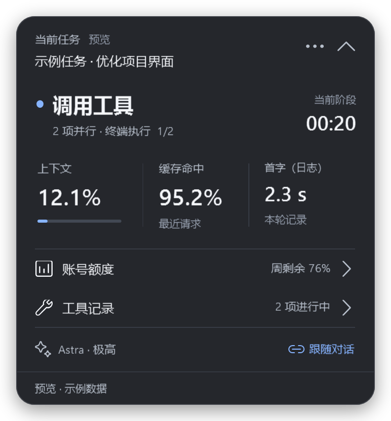
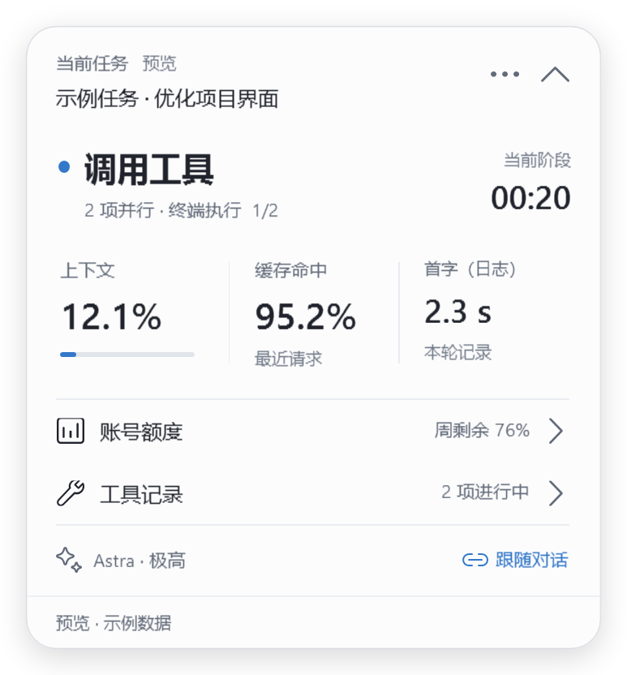
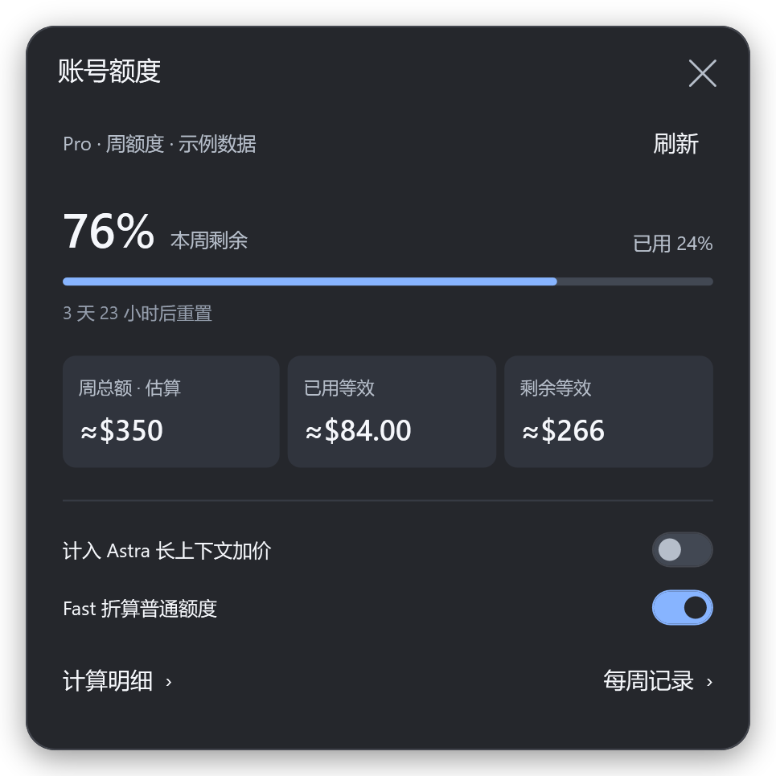
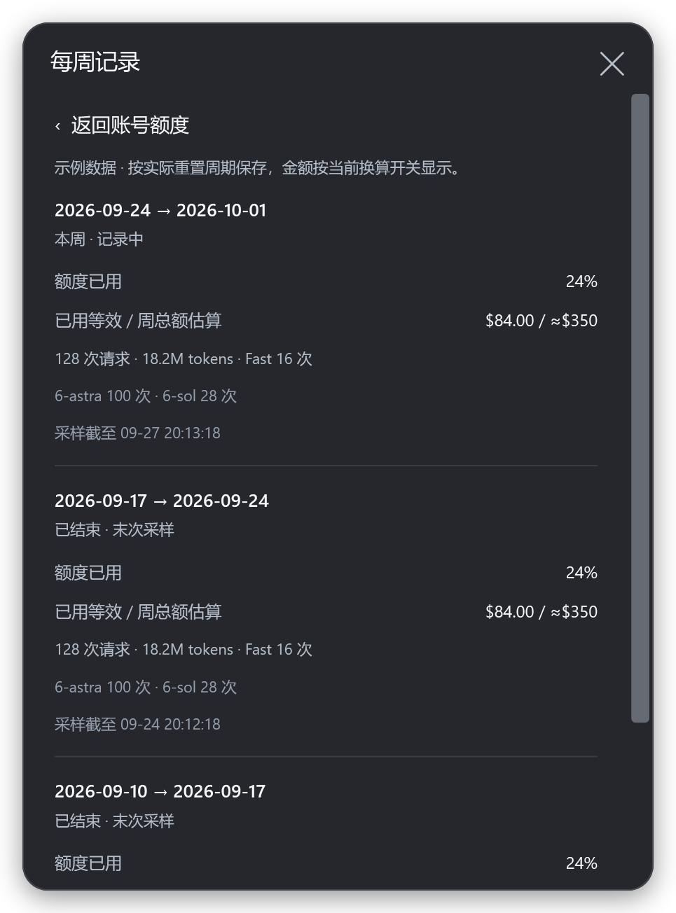
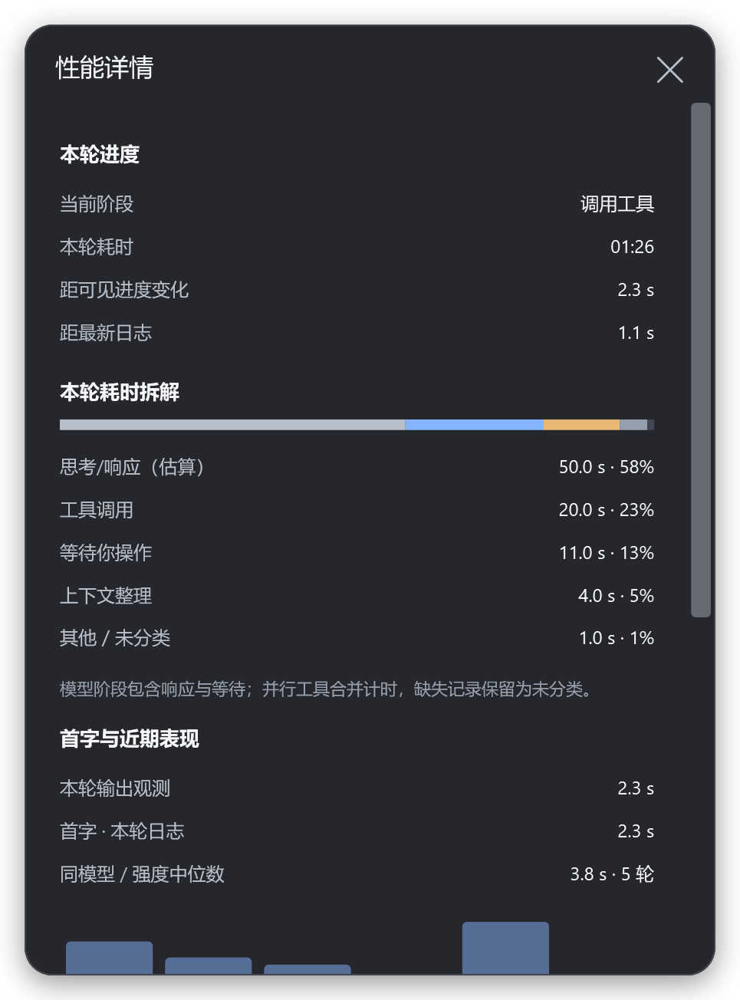
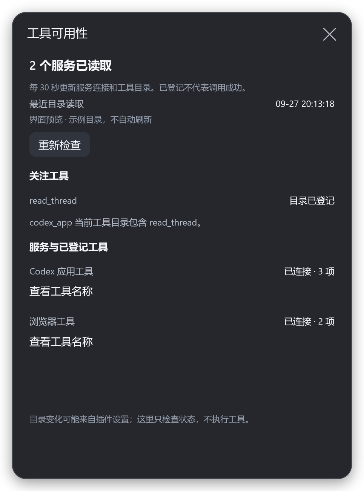

# Codex Enhance

**看清 Codex 正在做什么。**

一个轻量的 Windows 状态浮窗：实时显示思考、工具调用与等待状态，把上下文、账号额度和调用记录放在手边。

[**下载 Windows 版**](https://github.com/hrx114514x/codex-enhance/releases/latest) · [快速开始](#快速开始) · [更新记录](CHANGELOG.md) · [反馈问题](https://github.com/hrx114514x/codex-enhance/issues)

  
  

*原生界面截图，使用示例数据。*

## 快速开始

1. 下载 [**CodexEnhance-v0.3.0-win-x64.zip**](https://github.com/hrx114514x/codex-enhance/releases/download/v0.3.0/CodexEnhance-v0.3.0-win-x64.zip)，完整解压。
2. 确认已安装并登录 Windows Codex 桌面客户端。
3. 双击 **Start Codex.cmd**。

自带运行环境，无需安装 Node.js 或 .NET。可选运行 **Install.cmd** 安装并创建桌面快捷方式；**Preview.cmd** 可预览界面。

如果提示待连接，保存工作并正常退出 Codex，再用上述入口打开。更新前先从托盘退出旧版浮窗，再安装新版，设置会保留。

## 功能

| 功能 | 你能看到什么 |
| --- | --- |
| **实时阶段** | 当前正在思考、调用工具、等待确认或整理上下文；只显示当前阶段的计时 |
| **工具动态** | 并行调用轮换展示，记录和异常按需展开 |
| **性能详情** | 上下文、缓存、首字趋势和本轮耗时拆解 |
| **账号额度** | 剩余比例、重置倒计时和本机等效金额估算 |
| **每周记录** | 按额度重置周期回看历史用量 |
| **贴合桌面** | 跟随任务、固定观察、轻量收起、深浅色与柔和阴影 |

  
  

更多界面

  
  

## 为什么做它

使用 Codex 时，经常遇到卡顿、工具异常，或看不出任务是否还在推进。Codex Enhance 把可观察的状态放到一个小浮窗里，让等待更清楚，也让排查有据可依。

## 使用说明

- 数据在本机处理，不上传对话内容，不需要额外 API Key。
- 金额是本机模型用量估算，**不是官方余额或账单**；不含语音和其他设备的用量。
- 支持 Windows x64 的 Codex 桌面程序包。客户端更新可能影响连接，多个窗口与显示器仍在持续验证。
- 发布包目前未签名，附有 SHA-256 校验文件。

这是独立社区项目，与 OpenAI 没有官方关联。

[安装与使用](docs/getting-started.md) · [指标说明](docs/metrics.md) · [开发文档](docs/development.md) · [第三方许可](THIRD_PARTY_NOTICES.md)