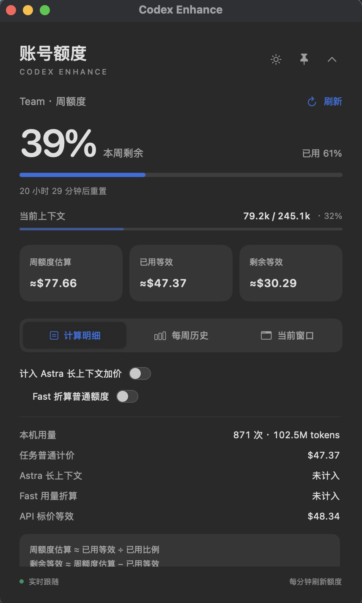
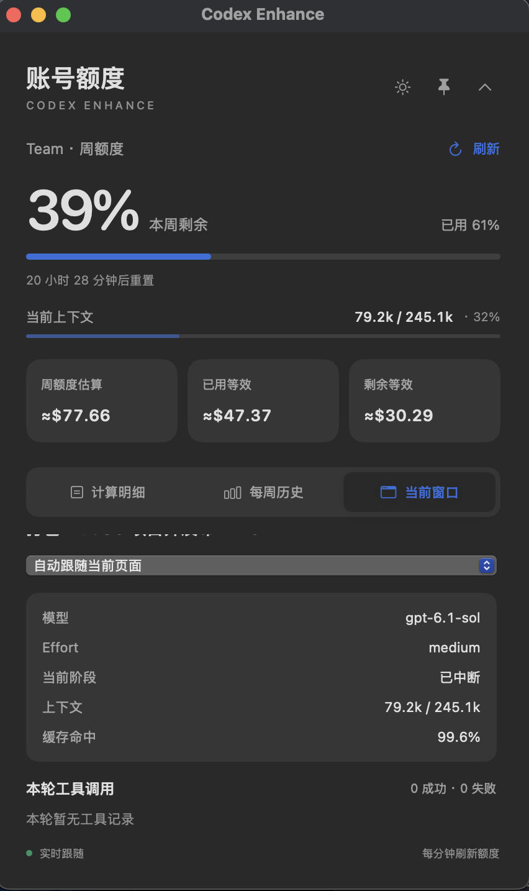

# Codex Enhance for macOS

**看清 Codex 正在做什么，也看清本机用量如何折算。**

[下载 DMG](https://github.com/Rachellincn/codex-enhance-macos/releases/latest) · [中文](README.md) · [English](README.en.md) · [反馈问题](https://github.com/Rachellincn/codex-enhance-macos/issues)

本项目集成自 [hrx114514x/codex-enhance](https://github.com/hrx114514x/codex-enhance)，基于上游 `f55ee83`（v0.4.0）复用 Node.js 采集层，并移植为 **macOS 原生 SwiftUI / AppKit 浮窗**。感谢上游作者和贡献者。本仓库新增并完善模型价格表、额度计算与每周历史，加入**当前窗口的工具调用详情**。保留上游 Windows 源码；Windows 使用请访问上游项目。

这是独立社区项目，与 OpenAI 没有官方关联。

<p>
  
  
</p>

*macOS 原生界面：计算明细与当前窗口。*

## 快速开始

1. 安装并登录 Codex 桌面客户端；使用 **macOS 13.5 或更高版本、Apple Silicon（M 系列）Mac**。
2. 从 [Release](https://github.com/Rachellincn/codex-enhance-macos/releases/latest) 下载 `CodexEnhance-v0.4.0-mac.4-macos-arm64.dmg`。
3. 打开 DMG，将 **Codex Enhance.app** 拖入 **Applications（应用程序）**，弹出磁盘后从“应用程序”启动。
4. 查看账号额度和每周记录；切换到“当前窗口”查看模型、上下文及本轮工具调用。

安装包内置 Node.js，用户无需安装 Node.js、.NET 或额外 API Key。关闭窗口后可从菜单栏图标重新显示；按 `⌘Q` 完全退出。更新前退出旧版，再替换 App；本机设置和历史会保留。

当前发行包采用 ad-hoc 签名，**尚未进行 Apple Developer ID 签名与公证**。首次打开如果被 macOS 阻止，可在尝试打开后前往“系统设置 → 隐私与安全性 → 仍要打开”，确认来源后继续。附带 `SHA256SUMS.txt`：将 DMG 和该文件放在同一目录，再运行 `shasum -a 256 -c SHA256SUMS.txt` 校验。

## 功能

| 功能 | 你能看到什么 |
| --- | --- |
| 原生 Mac 浮窗 | 置顶、收起、菜单栏入口、深浅色切换及偏好保存 |
| 实时账号额度 | 通过 Codex app-server 只读接口读取剩余比例和重置时间，每分钟刷新 |
| 完善价格表 | 输入、缓存读取、缓存写入、输出分别计价，支持 Fast 与长上下文规则 |
| 计算明细 | 普通计价、加价组成、API 等效金额及 Astra / Fast 折算开关 |
| 每周历史 | 按账号实际重置周期保存最近 26 个周期，查看额度、tokens、等效金额和采样缺口 |
| 当前窗口 | 自动跟随当前页面或固定观察任务，展示模型、effort、阶段、上下文、缓存命中 |
| 工具调用详情 | 本轮工具名称、状态、耗时与诊断原因；悬停查看可用详情，最多显示 40 条 |

工具状态区分成功、失败、执行中、已中断和待确认。采样不足、模型未定价或记录不完整时显示“—”及原因。语音统计在 Mac 版禁用；上游 Windows 的工具目录检查和截图画廊界面尚未移植。

## 启用当前页面跟随

账号额度刷新不需要调试连接。要实时跟随当前页面，点击浮窗的“连接…”按钮，保存工作并等待任务结束，再确认正常重启客户端。连接助手请求仅绑定 `127.0.0.1` 的本机 CDP 调试端口（9336–9350）；不会强制结束进程。自动跟随不可用时会标注“本地记录”，临时显示最近更新的任务；也可手动选择任务固定观察。

支持 `Codex.app`，以及包含 Codex Framework 的 `ChatGPT.app`。客户端版本和内部接口变化可能影响连接；同时使用多个窗口时请核对当前任务，必要时固定观察。上游响应模型仅在存在对应记录时显示。

## 本地模型价格表

以下是本发行包内置的**估算配置**，单位为 **美元 / 每百万 tokens**，并非对当前官方价格的重新核验。完整规则见 [collector/prices.json](collector/prices.json)，金额不是官方余额或账单。

| 模型 | 输入 | 缓存读取 | 缓存写入 | 输出 |
| --- | ---: | ---: | ---: | ---: |
| `gpt-6.1-sol` | $2 | $0.1 | $2.5 | $10 |
| `gpt-6-astra` | $10 | $1 | $12.5 | $50 |
| `gpt-6-sol` | $2 | $0.2 | $2.5 | $10 |
| `gpt-6-luna` | $0.1 | $0.01 | $0.125 | $0.5 |
| `gpt-5.6-sol` | $4 | $0.4 | $5 | $20 |
| `gpt-5.6-terra` | $2 | $0.2 | $2.5 | $12 |
| `codex-auto-review` | $2 | $0.2 | $2.5 | $12 |
| `gpt-5.6-luna` | $0.2 | $0.02 | $0.25 | $1.2 |
| `gpt-5.5` | $5 | $0.5 | — | $30 |
| `gpt-5.4` | $2.5 | $0.25 | — | $15 |

`codex-auto-review` 按本地指定的 `gpt-5.6-terra` 规则折算，保留原始模型名；这不是官方公布的自动审批模型价格。“—”表示该项没有可用配置。Fast 和长上下文倍率见 JSON，API 等效金额与订阅额度折算分别计算。

价格目录定期读取本仓库公开 JSON，经过格式、大小和版本校验后缓存；离线时使用已校验缓存或内置目录。此请求不包含账号、任务、用量或凭据。

## 数据与使用边界

- 对话和用量在本机处理，保存于 `~/Library/Application Support/CodexEnhance`，只读访问 `$CODEX_HOME`（默认 `~/.codex`）的任务库和日志。
- 额度沿用本机已登录账号；不会创建模型任务或要求重新登录。
- API 等效金额是本机记录的估算，不包括其他设备和语音用量。没有观测记录的周期不会补造额度百分比。
- DMG 仅提供 Apple Silicon arm64；尚未发布 Intel 或 universal 安装包。英文 README 不表示界面已完成英文翻译，目前界面为中文。

## 从源码构建

需要 macOS 13.5+、Xcode Command Line Tools，以及 **Node.js 24+ 的独立运行时**。打包脚本会拒绝依赖 Homebrew 等非系统动态库的 Node 分发版。可使用官方 Node.js 运行时；通过 `NODE_BINARY` 指定绝对路径。

```bash
npm test
NODE_BINARY=/absolute/path/to/node npm run build:mac
open "dist/Codex Enhance.app"
NODE_BINARY=/absolute/path/to/node npm run package:mac
```

`build:mac` 生成原生 App，`package:mac` 独立构建 App 并生成 DMG、双语 README、版本清单和 SHA-256 校验文件，产物位于 `artifacts/releases/v0.4.0-mac.4/`。构建生成当前机器架构；发行版的最低系统版本为 macOS 13.5。

[macOS 使用说明](docs/macos.md) · [Mac 更新记录](docs/macos-changelog.md) · [上游更新记录](CHANGELOG.md) · [第三方声明与许可证](THIRD_PARTY_NOTICES.md)
